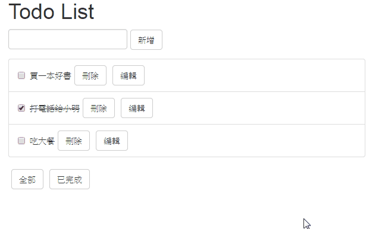

# Todo List: React and Redux Example
使用 React、Redux 和 [React-Bootstrap](https://react-bootstrap.github.io) 實作 Todo List。

## 功能介紹 / Demo

功能有：

- 新增 todo
- 刪除 todo
- 編輯一個 todo 的名稱
- 更改 todo 狀態：完成 / 未完成
- 切換 filter，列出全部或已完成的 todo

## 說明
程式碼說明如下。

### Constants
定義 Action Type 和 Model。

#### Action Type
將動作定義成常數並放在一個檔案中，例如：建立一個 todo(CREATE_TODO)、刪除一個 todo(DELETE_TODO)。

這樣做的好處是

- 這些常數會用於 create action 和 reducer，讓 action 和 reducer 直接引入和使用，對於 app 整合的效果較好
- 若使用 IDE 編輯程式碼，可以較容易看見常數在專案中使用的地方
- 可讓 linter 等的工具發揮作用
- 打錯字時會出現 ReferenceError 的報錯，減少在茫茫 code 海中 debug 的時間

#### Model
Model 的功能是

- 定義資料結構
- 設定初始值

這裡會使用`Immutable.fromJS()`將 TodoState 這個 JavaScript Object 轉換成 Immutable.js 可用的 Map 結構，之後的操作都會使用 Immutable.js 的 API，而非一般 JavaScript Object 操作的 API，別混淆了。

### Actions
使用`createAction`來包裝 action creator，使其回傳值是 flux 標準的 payload 格式。

### Reducers
更新 state。根據執行的動作，傳入目前的 state 和資料(payload)，經由運算後回傳下一步的 state。這裡也是使用 Immutable.js 的 API。

Immutable.js 存取物件或陣列是使用`set()`和`get()`；而當 list 或 map 內部有包 list 或 map 時，則需要使用`setIn()`和`getIn()`，並用指定索引的方式為放到陣列裡面，例如：

    var list_1 = Immutable.fromJS(['a', ['b', 'c', 'd'], 'e']);
    var list_2 = list1.set([1, 2], 'new'); //list_2 為 ['a', ['b', 'c', new'], 'e']

所以，當想要設定 TodoState 的 todos 中某個 item 的 completed 的值為 true 時，就要找到 TodoState 的 todos，再使用回傳的 index 找 todos 裡面指定的索引的元素，再找這個 item 裡面的 completed，然後設定 completed 為 true。

    state.setIn(['todos', payload.index, 'completed'], true);

### Store
建立 Redux store 存放 app 的所有 state，唯一能改變 state 的方法只有發送 action。

### Components
純 View的 展示，這裡切分 Components 為

- Layout：最外層的框架，用來包裝 TodoHeader、TodoList 和 Filter
- TodoHeader：含有新增 todo 功能
- TodoList：顯示 todo 列表
- Filter：切換顯示全部或已完成的 todo

### Container
使用 Container 和 Store 溝通，在此發送 dispatch 到 action更改 state。關於這樣的拆分方式可參考[這篇](https://medium.com/@dan_abramov/smart-and-dumb-components-7ca2f9a7c7d0#.nr2ds9lyk)。

## 參考資料
- [Redux 實戰入門](https://github.com/kdchang/reactjs101/blob/master/Ch07/react-redux-real-world-example.md)
- [Immutable.js 簡介](https://rhadow.github.io/2015/05/10/flux-immutable)
- [Presentational and Container Components](https://medium.com/@dan_abramov/smart-and-dumb-components-7ca2f9a7c7d0#.nr2ds9lyk)